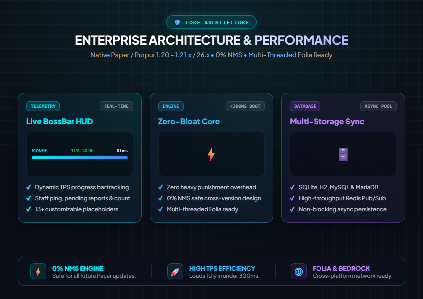
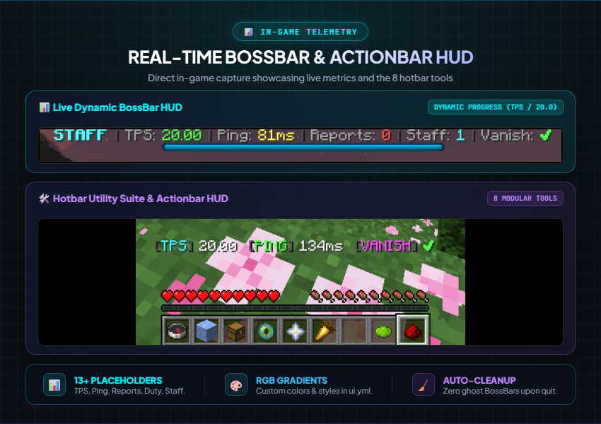
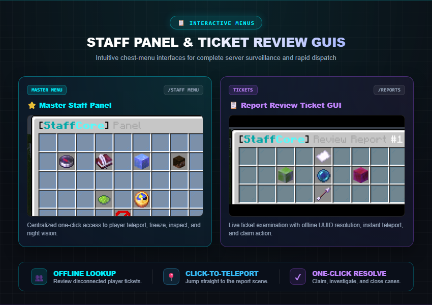
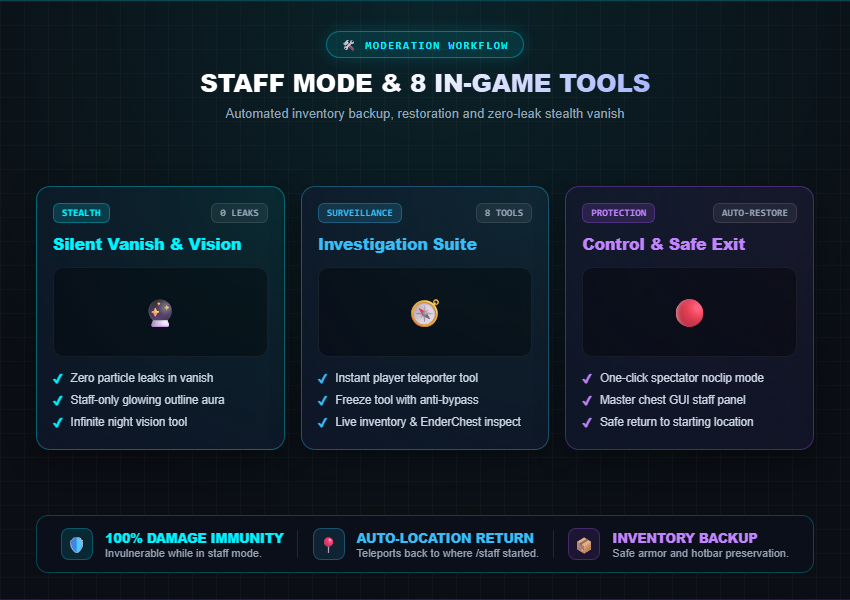
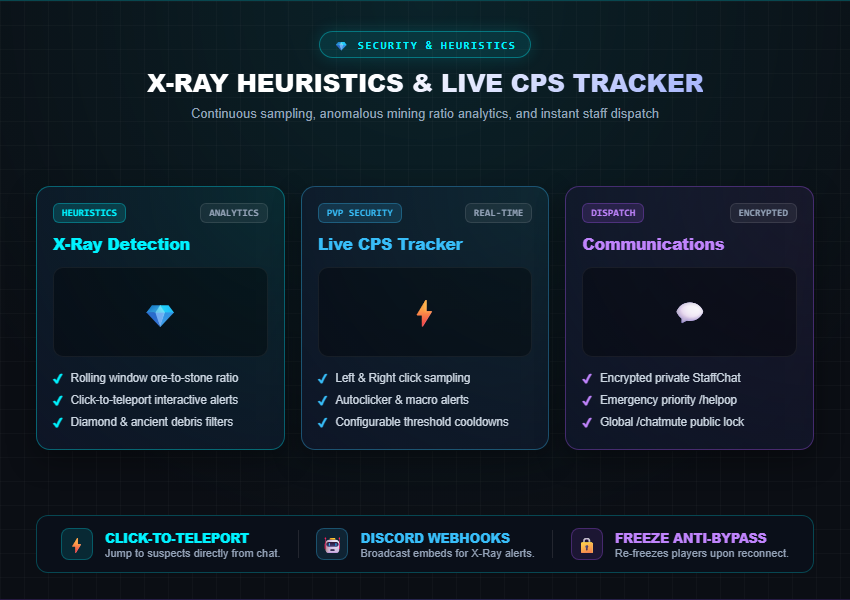
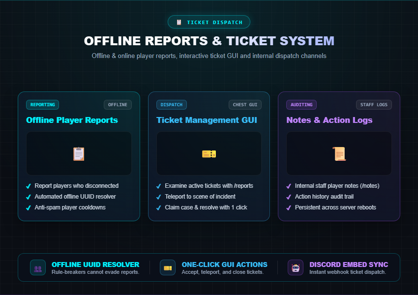
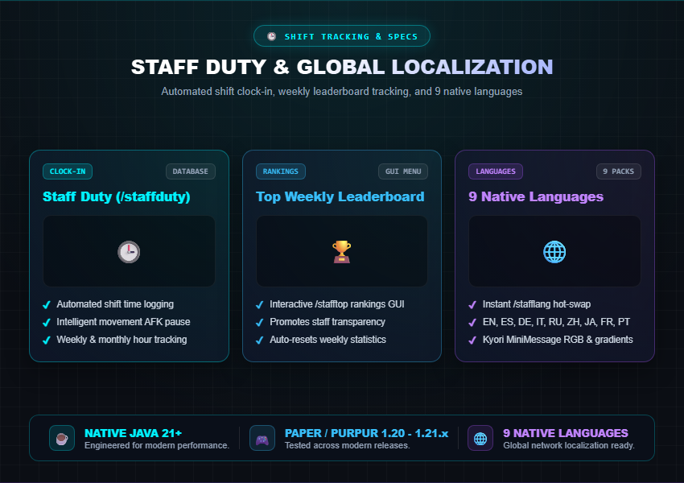

# 🛡️ StaffCore v2.0.0

### Next-Gen Enterprise Moderation & Staff Management Suite for Paper / Purpur

---

### 🎥 Official Showcase Video

*(Click above to watch the full in-game showcase on YouTube)*

---

 

 

 

 

 

 

---

## 📖 Overview

**StaffCore v2.0.0** is an enterprise-grade moderation ecosystem engineered for modern Paper, Purpur, and Folia servers. Built for networks and server administrators that demand **absolute control, visual clarity, live HUD BossBar metrics, strict anti-abuse protections, and seamless staff workflow** without heavy bloated punishment dependencies.

---

## ✨ Features

- 🕵️ **Staff Mode:** Seamlessly switch into staff mode with automated inventory, armor, and location restoration.
- 📊 **Staff Live BossBar HUD:** Real-time TPS (dynamic progress bar), Staff Ping, Open Reports counter, and active online staff counter right on the BossBar.
- 🌟 **Glowing Silhouette Aura:** Outlines the staff character model with glowing aura (completely hidden in Vanish).
- 🛠️ **8 Hotbar Tools:**
  - 🧭 **Teleporter:** Jump directly or randomly to players.
  - 🧊 **Freeze Tool:** Instantly freeze/unfreeze suspects with anti-disconnect re-freeze.
  - 📦 **Inspector:** View inventory, armor, enderchest & stats in real-time.
  - 👁️ **Spectator Tool:** One-click toggle between flight and spectator noclip mode.
  - ⭐ **Staff Panel:** GUI moderation menu.
  - 🥕 **Night Vision:** Infinite clear vision toggle.
  - 🔮 **Vanish:** Complete silent invisibility with zero particle leaks.
  - 🔴 **Safe Exit:** Safely restore player mode and original location.
- 📋 **Report System:** Offline & Online player reports with `/report <player> <reason>` and GUI tickets with `/reports`.
- 🕒 **Staff Duty & Leaderboards:** Clock-in system (`/staffduty`) with movement AFK detection and weekly leaderboard (`/stafftop`).
- 💎 **Heuristic X-Ray Alerts:** Rolling-window ore-to-stone ratio analytics with instant click-to-teleport alerts.
- ⚡ **Real-Time CPS Tracker:** Left & Right click speed sampling and automated macro detection.
- 🌐 **9 Native Languages:** English, Spanish, German, Italian, Russian, Chinese, Japanese, French, Portuguese (`/stafflang`).

---

## 💻 Commands & Permissions

| Command | Description | Permission |
|---|---|---|
| `/staff` | Toggle staff mode (saves & restores inventory & location) | `staffcore.staff` |
| `/staff menu` | Open master GUI panel | `staffcore.staff` |
| `/staff speed <0-10>` | Adjust walk speed | `staffcore.staff` |
| `/staff flyspeed <0-10>` | Adjust fly speed | `staffcore.staff` |
| `/vanish` | Toggle silent invisibility | `staffcore.vanish` |
| `/freeze <player> [reason]` | Freeze a suspect | `staffcore.freeze` |
| `/freeze claim <player>` | Claim freeze investigation | `staffcore.freeze` |
| `/report <player> <reason>` | Submit a report (online or offline player) | None |
| `/reports` | Manage reports tickets GUI | `staffcore.reports` |
| `/staffduty` | Toggle staff duty time tracking | `staffcore.staff` |
| `/stafftop` | View staff duty leaderboard | `staffcore.staff` |
| `/staffchat <msg>` | Private staff chat channel | `staffcore.chat` |
| `/chatmute` | Toggle global server chat lock | `staffcore.chatmute` |
| `/helpop <msg>` | Priority help request | `staffcore.helpop` |
| `/notes <player> [add\|remove\|list]` | Internal staff notes | `staffcore.notes` |
| `/stafflogs [player\|clear]` | Audit staff action history | `staffcore.logs` |
| `/stafflang <code>` | Change player language (9 languages) | `staffcore.lang` |
| `/xrayalerts` | Manage X-Ray alerts | `staffcore.xray` |
| `/staff reload` | Reload configurations and languages | `staffcore.admin` |

---

## 🚀 Installation

1. Download **`StaffCore-2.0.0.jar`** from [SpigotMC](https://www.spigotmc.org/resources/staffcore-advanced-staff-moderation-suite.134819/) or [Modrinth](https://modrinth.com/plugin/staffcore-dafealru).
2. Place the `.jar` in your server's `plugins/` directory.
3. Start or reload your server (**Paper / Purpur 1.20 - 1.21+ / Java 21+** recommended).
4. Configure permissions in **LuckPerms** (`staffcore.admin` or `staffcore.staff`).

---

Developed with ❤️ by **Dafealru** for the Minecraft community.

